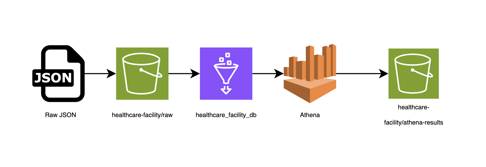
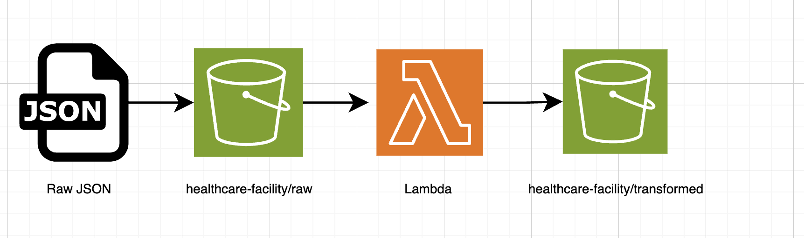
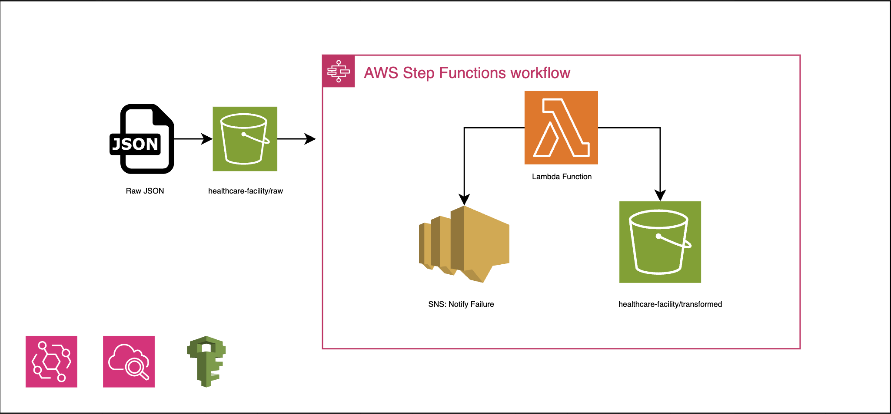

# **Healthcare Facility Analytics – AWS Data Engineering Challenge**

### End-to-End Serverless Data Pipeline (Athena • Glue • Python • Lambda • Step Functions)

---

## 📌 **Overview**

This project implements a fully serverless AWS data pipeline that analyzes accreditation data for healthcare facilities. The pipeline ingests raw JSON files, processes nested attributes, extracts insights, identifies expiring accreditations, and orchestrates automated workflows for reporting and monitoring.

This solution satisfies **Stages 1, 2, 3, and 4** of the AWS Data Engineering Challenge, with a strong focus on **cost-efficiency**, **scalability**, and **production-ready architecture**.

---

## 🗂 **Repository Structure**

```
├── data/
|
├── stage1/
│   ├── query/stage1.sql
│   ├── Stage 1 Architecture.png
│   └── screenshots/
│
├── stage2/
│   ├── scripts/transform_data.py
│   └── screenshots/
│
├── stage3/
│   ├── scripts/stage3_lambda.py
│   ├── Stage 3 Architecture.png
│   └── screenshots/
│
├── stage4/
│   ├── scripts/stage4_lambda.py
│   ├── Stage 4 Architecture.png
│   └── screenshots/
|
├── stage4/
│
└── README.md
```

---

## 📊 **Data Directory**

The `data/` directory contains sample healthcare facility datasets used throughout this project for testing and demonstration purposes.

### **Files**

#### `sample_facility_data.json`

- **Format:** JSON Lines (JSONL)
- **Records:** 3 healthcare facilities
- **Purpose:** Minimal dataset for quick testing and initial development

#### `extended_sample_facility_data.json`

- **Format:** JSON Lines (JSONL)
- **Records:** 10 healthcare facilities
- **Purpose:** Extended dataset for comprehensive testing across multiple states and facility types

### **Data Schema**

Each facility record contains the following structure:

```json
{
  "facility_id": "FAC12345",
  "facility_name": "City Hospital",
  "location": {
    "address": "123 Main St",
    "city": "Metropolis",
    "state": "TX",
    "zip": "75001"
  },
  "employee_count": 250,
  "services": [
    "Emergency Care",
    "Maternity",
    "Surgery",
    "Radiology",
    "Laboratory"
  ],
  "labs": [
    {
      "lab_name": "Hematology Lab",
      "certifications": ["CLIA", "CAP"]
    }
  ],
  "accreditations": [
    {
      "accreditation_body": "Joint Commission",
      "accreditation_id": "JC1001",
      "valid_until": "2026-12-31"
    }
  ]
}
```

### **Key Attributes**

- **Nested Objects:** `location` contains address details
- **Arrays:** `services`, `labs`, and `accreditations` are variable-length arrays
- **Date Fields:** `valid_until` dates range from 2024 to 2027, enabling expiration analysis
- **Geographic Diversity:** Facilities span multiple US states (TX, CA, FL, OR, AZ, CO, IL, WA, MA, GA)
- **Facility Types:** Includes hospitals, clinics, urgent care centers, specialized medical centers

### **Usage in Pipeline**

1. **Stage 1:** Raw JSON files are uploaded to `s3://healthcare-facility/raw/` and queried via Athena
2. **Stage 2:** Python scripts process these files to identify expiring accreditations
3. **Stage 3 & 4:** New file uploads trigger automated Lambda/Step Functions workflows

---

# 🚀 **Stage 1 – Data Extraction with Athena & Glue**

### **Goal:**

Extract structured data from nested JSON stored in S3 using Amazon Athena.

### **Architecture:**



### **How it works**

1. Raw JSON is uploaded to:
   **`s3://healthcare-facility/raw/`**
2. A **Glue Crawler** infers schema and creates the table:
   **`healthcare_facility_db.raw`**
3. Athena queries nested fields such as:

   - `location.state`
   - arrays of services
   - arrays of accreditation structs

4. Query results are stored in:
   **`s3://healthcare-facility/athena-results/`**

### **Example Query (Stage 1 Requirement)**

```sql
SELECT
    facility_id,
    facility_name,
    employee_count,
    cardinality(services) AS number_of_offered_services,
    accreditations[1].valid_until AS expiry_date_of_first_accreditation
FROM healthcare_facility_db.raw;
```

---

# 🐍 **Stage 2 – Data Processing with Python (boto3)**

### **Goal:**

Identify facilities with at least one accreditation expiring within the next 6 months.

### **Key Features**

- Reads raw JSON from S3
- Supports JSON Lines & JSON Array formats
- Filters facilities by `valid_until` date
- Writes processed output to:
  **`s3://healthcare-facility/transformed/`**
- Uses an IAM user with **least privilege**
- Includes logging, error handling, and input validation

### **Example Output:**

`transformed/expiring_facilities.json`

### **Script:**

Located in `stage2/process_facilities.py`

---

# ⚡ **Stage 3 – Event-Driven Processing (S3 → Lambda → Athena)**

### **Goal:**

Automatically compute **accredited facility counts per state** whenever new raw data is uploaded.

### **Architecture:**

_(Insert your Stage 3 diagram here)_


### **Flow**

1. A new JSON file lands in:
   **`s3://healthcare-facility/raw/`**
2. S3 publishes an event → Lambda invocation
3. Lambda executes an Athena query:

```sql
SELECT
    location.state,
    COUNT(DISTINCT facility_id) AS accredited_facility_count
FROM healthcare_facility_db.facilities_raw
WHERE cardinality(accreditations) > 0
GROUP BY location.state;
```

4. Athena writes intermediate CSV to:
   **`s3://healthcare-facility/athena-temp/`**
5. Lambda copies result to:
   **`s3://healthcare-facility/analytics/state_counts/...`**

### **Lambda Highlights**

- Boto3 Athena polling
- Retry + error retry logic
- IAM role with S3 + Athena + Glue permissions
- Structured logging for debugging

---

# 🔁 **Stage 4 – Workflow Orchestration with Step Functions**

### **Goal:**

Coordinate the full workflow and send alerts on failure.

### **Architecture:**

_(Insert your Stage 4 diagram here)_


### **Flow**

1. S3 event is routed through **EventBridge**
2. EventBridge triggers Step Functions
3. Step Functions:

   - Invokes the Lambda from Stage 3
   - Handles Lambda retry logic automatically
   - Sends failure notifications via SNS
   - Terminates in a clean “Success” state on completion

### **Error Handling Path**

If Lambda or Athena fails:

- Step Functions transitions to `NotifyFailure`
- Publishes message to SNS topic:
  `facility-pipeline-failures`
- Email notification is sent immediately

---

# 🧪 **Testing**

### Stage 1

- Run Athena query from console
- Verify output under `athena-results/`

### Stage 2

- Run Python script locally using AWS profile
- Check `transformed/expiring_facilities.json`

### Stage 3

- Upload a file to `raw/`
- Inspect Lambda CloudWatch Logs

### Stage 4

- Upload a file → EventBridge triggers Step Functions
- Observe workflow steps in Step Functions console
- Simulate failure → verify SNS email delivery

---

# 💰 **Cost Optimization**

This solution is fully free-tier friendly:

- Athena scanning small JSON files (< 1 MB)
- Very few Lambda invocations
- Step Functions standard workflow (< 10 transitions)
- S3 free tier covers storage
- SNS is free for email notifications
- Glue Crawler run once

---

# 📚 **Technologies Used**

- Amazon S3
- AWS Glue Data Catalog
- AWS Athena
- Python + boto3
- AWS Lambda
- Amazon EventBridge
- AWS Step Functions
- Amazon SNS
- IAM (least privilege design)

---

# 🧾 **Stage Selection Rationale**

I chose **all 4 stages** to demonstrate full-stack data engineering capabilities:

- **Stage 1** shows SQL skills and AWS Glue/Athena integration
- **Stage 2** demonstrates Pythonic data processing and boto3 automation
- **Stage 3** highlights event-driven serverless design
- **Stage 4** adds enterprise-grade orchestration and fault tolerance

This combination showcases real-world cloud engineering thinking across ingestion, transformation, orchestration, monitoring, and robustness.

---

# 🎥 **Demo Video**

_(Insert Loom/YouTube link here)_

---

# 🙏 **Acknowledgements**

This project was developed with assistance from generative AI tools, which were used for:

- Architecture planning and design consultation
- Code review and debugging assistance
- Documentation structuring and technical writing
- AWS best practices validation

All core implementation, architecture decisions, and technical problem-solving were performed independently, with AI serving as a productivity tool to accelerate development and ensure comprehensive documentation.
